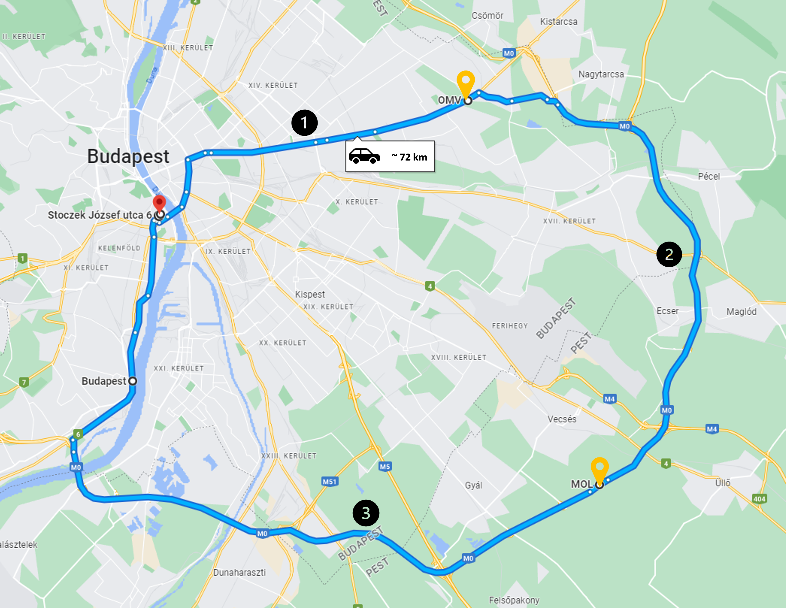

# V2X measurement on M0 motorway 

V2X data collection under real world conditions.

**Applicability of this dataset**:
- V2X traffic analysis (for research and application development purposes) 
- Comparison of PKI and PKI-authenticated 802.11p-based V2X communication (ITS-G5)

**Location**: Hungary, Budapest + M0 motorway (ringroad around Budapest)  

**Date**: 19th May 2023 

**Test participants**:  
- [Budapest University of Technology and Economics](https://www.bme.hu/?language=en)  
    - [Faculty of Transportation Engineering and Vehicle Engineering](https://transportation.bme.hu/)  
        - [Department of Automotive Technologies](https://www.auto.bme.hu/) - [BME Automated Drive Lab](https://www.automateddrive.bme.hu/)  
        - [Department of Control for Transportation and Vehicle Systems](http://www.kjit.bme.hu/index.php/en/) - [BME Traffic Lab](https://traffic.bme.hu/)
    - [Faculty of Electrical Engineering and Informatics](https://www.vik.bme.hu/en/)
        - [Department Of Telecommunications and Media Informatics](https://www.tmit.bme.hu/?language=en)
- [Microsec Ltd. (PKI provider)](https://www.microsec.hu/en)

**Communication hardware**: 4x [Cohda Wireless MK5 OBUs](https://www.cohdawireless.com/solutions/hardware/mk5-obu/) (2 vehicles with PKI-on, 2 vehicles with PKI-off)  

**V2X stack** : Cohda Wireless ETSI stack (Physical layer: ITS-G5)  

**Security stack**: [Microsec V2X PKI](https://www.microsec.hu/en/v2x-pki)  

**Weather and road conditions**: Clear and sunny weather, dry road

**The datasets includes information on**:
- ITS-G5 Physical layer parameters (e.g. signal strength, signal quality etc.).
- GNSS-positioning information (**gnss.json**)
- Decoded received and transmitted V2X messages (secured and not secured GeoNetworking packets)
    - **Rx.json** – includes all received V2X messages by that specific host vehicle (CAM, DENM) also including RSU messages (CAM, DENM, MAPEM, SPaTEM, IVIM)
    - **Tx.json** – includes all transmitted V2X awareness messages by that specific host vehicle (CAM, DENM)

 